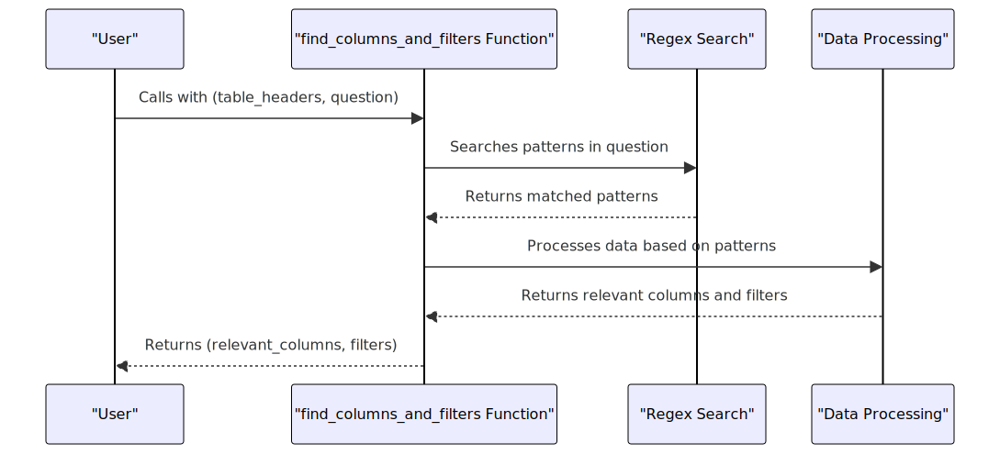

# Ask-FootBall
Ask me Questions about Football.

Problem : We should have give some Table header's, with the help of these data header's we should have to write a function that can take table header's and question and return which table header's field extracted and filter's applied to it.

# Approch of solving this problem.

## Improvements that can be done

- More regex search fieds can be added to cover more edge cases
- Some generic mechanism to identify similar keywords can be implementd 
- Some kind of user feedback can we taken (ie): Somewhat expected data and by that feedback more regex edge cases could be added.
- Currently the system uses pure regex to identify token in the questions, We can use some NLP libraries to do so.